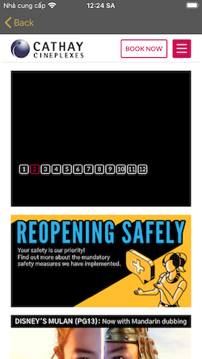

# Movies Demo

An application to help our users discover movies easily. For the UI:

           Discovery         ->          Movie Detail           ->         Booking 

       

##  Requirements
- iOS 13.4+
- Xcode 11
### Installations
Remember to run ``` pod install ``` before running the project.

##  Resources
- ``` SwiftLint ```: a tool to enforce Swift style and conventions. Keeping a codebase consistent and maintainable.
- ``` Moya ``` : a network abstraction layer that leverages Swift’s APIs like enums to make working with the network layer better than ever.
- ``` SDWebImage ```: an asynchronous memory + disk image caching with automatic cache expiration handling, support background image decompression to avoid frame rate drop.

##  Structure
- MVVM: Model - View - ViewModel
- App flow: Movies (Discovery) -> MovieDetail -> Booking
   + ```MoviesViewController```, ```MoviesViewModel``` is related to Discovery screen (first screen)
   + ```MovieDetailViewController```, ```MovieDetailViewModel``` is related to MovieDettail screen (second screen)
   + ```BookingViewController``` is related to Booking screen (third screen)
- Coordinator: to manage app's navigations. (``` Coordinator ``` protocol and ``` MainCoordinator ```)
- Adapter: to move data sources and delegates out of view controllers (``` MoviesListAdapter ```)
- Api services:
    + ```MovieService``` contains a provider which will be the main object that we will use to interact with any ```MovieTarget``` endpoints.
    + A Target (```MovieTarget```) should conforms to a protocol named ```TargetType```, which requires the entire endpoints informations, such as: baseUrl, header, path, parameters, method, task(make request), etc..( by using enum, case by case, entirely type-safe 🎉.)
    
##  Unit Test Coverage


## That's it! Enjoy the app!
